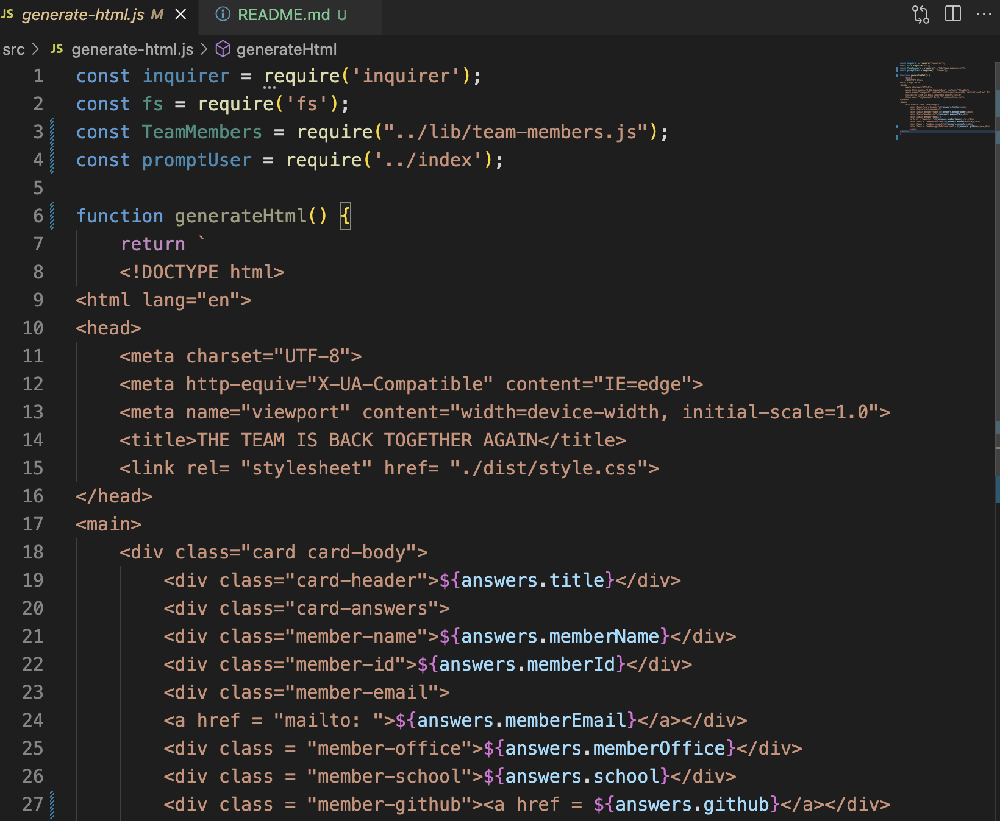
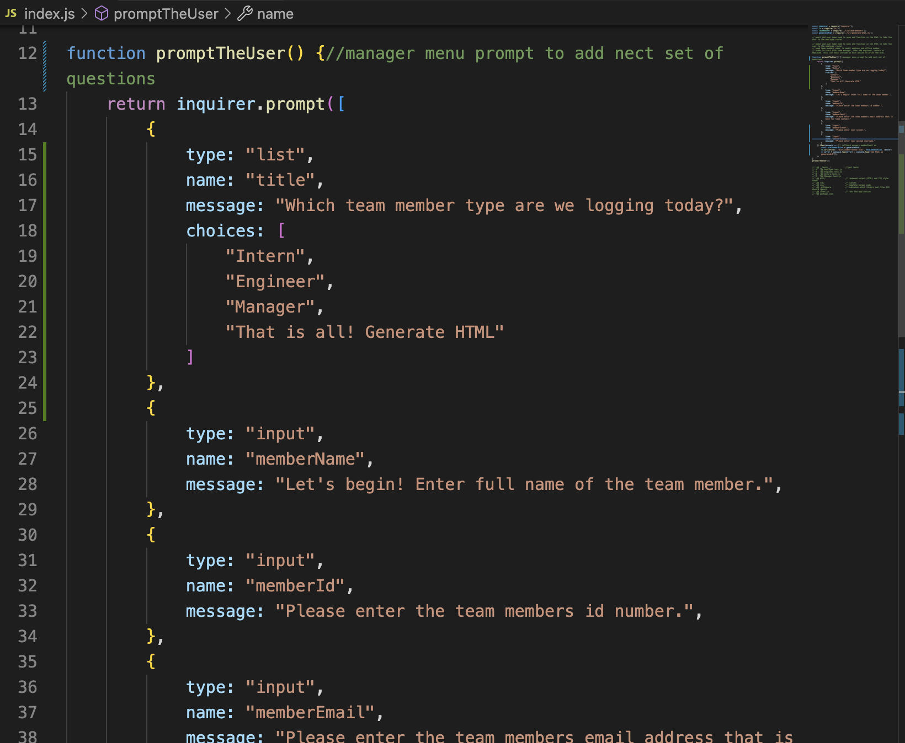
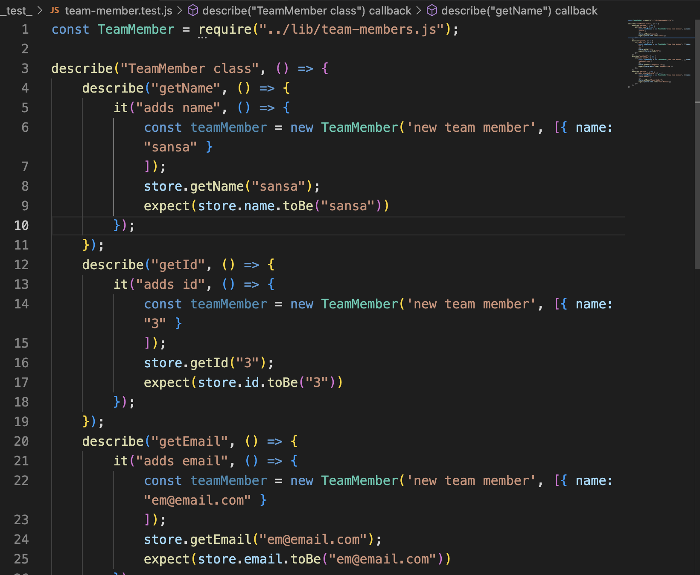

# Creating a Roster for your team.

This week we are tasked with creating a node.js program that will take user input to create a roster of team members. 
*****

## Installation
  Using a machine pre installed with Node, you run this program from your local machine’s terminal from the index.js file. 
*****

******
I was unable to add my test and contuine using the inquire after I began. I tried file paths, reading the jest documentation and implimenting the same code found in our class assginments. I ran out of time and turning in what I have at this time. 

*******
### Test 
[Here is a video deomostrating the function of this program](https://drive.google.com/file/d/1WTuRAI5zSM962VabvrBVx4rQS-X-YyEo/view)
The program is still not functioning as I would expect. I needed the classes to function seperatly and they are not. 
